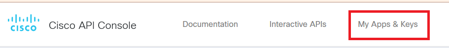
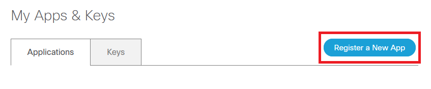
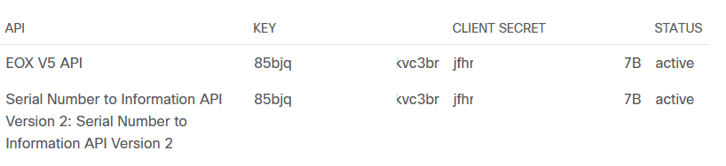

# Cisco Support APIs and EOL/EOS Dates
This package contains ties to DNA Centre and the Cisco Support APIs to programatically find contract information, as well as all EOL/EOS dates for any Switches or Routers within DNA Centre. The scope of devices can be expanded so long as a serial number and a model number can be obtained.

## Prerequisites
- DNA Centre account
- [Cisco API Console](https://apiconsole.cisco.com) access
- Access to Cisco Support APIs. The Smart Net Delegated Administrator must provision your Cisco account as detailed in [this document](https://www.cisco.com/c/dam/en/us/support/docs/services/sntc/Guide-to-Assigning-Customer-API-Roles.pdf).
- **One** Cisco API key with access to the following:
  - SN2INFO (Serial Number to Information)
  - EOX (End of Support)
- Python
- Python libraries:
  - dnacentersdk
  - easygui
  - requests

## Important Links
- [Cisco API Console](https://apiconsole.cisco.com)
- [Cisco Support API Documentation](https://developer.cisco.com/docs/support-apis)
  - [Authentication](https://developer.cisco.com/docs/support-apis/#!authentication)
  - [EOX (End of Support)](https://developer.cisco.com/docs/support-apis/#!eox)
  - [SN2INFO (Serial Number to Information)](https://developer.cisco.com/docs/support-apis/#!serial-number-to-information)
- [Enabling Access to Cisco Support APIs](https://www.cisco.com/c/dam/en/us/support/docs/services/sntc/Guide-to-Assigning-Customer-API-Roles.pdf)
- [Cisco Support API Email Support](mailto:supportapis-help@cisco.com)

# Getting Started
## Cisco API Console Account
1) The first step in all of this is exposing the Cisco Support APIs to your Cisco account through Smart Net Total Care (SNTC). The SNTC Delegated Administrator (DA) must [follow this document](https://www.cisco.com/c/dam/en/us/support/docs/services/sntc/Guide-to-Assigning-Customer-API-Roles.pdf) in order to expose the appropriate APIs.
2) Log into the [Cisco API Console](https://apiconsole.cisco.com) and create an API key.
   1. Click on "My Apps & Keys".   

   2. Click "Register a New App".  

   3. Give the application a name and description.  

   4. Under OAuth2.0 Credentials, select "Client Credentials".  

   5. Under Select APIs, select **EOX Vx API** and **Serial Number to Information API Version x**.  
   **Note**: If you don't see the two APIs, ensure that your SNTC Delegated Administrator completed the instructions in Step 1. If still your account is not exposed to **both** of the required APIs, [email Cisco's API support team](mailto:mailto:supportapis-help@cisco.com) and explain exactly which APIs you're unable to see.
 
   6. Agree to the Terms of Service, and click "Register".  

   7. Once completed, you'll see your application registered with a key and secret. Keep these noted. You can always view these again at a future date, but you'll need these to execute the script.  

## Configuring Python
1. [Download and Install Python](https://www.python.org/downloads/) if not already installed on your machine.
2. Open a terminal window and navigate to this directory.
3. Execute the following to install this project's required Python libraries: `python -m pip install -r requirements.txt`

# Executing / Obtaining the Report
1. Open a terminal to this directory.
2. Execute the following: `python runFile.py`

If any errors occur, 